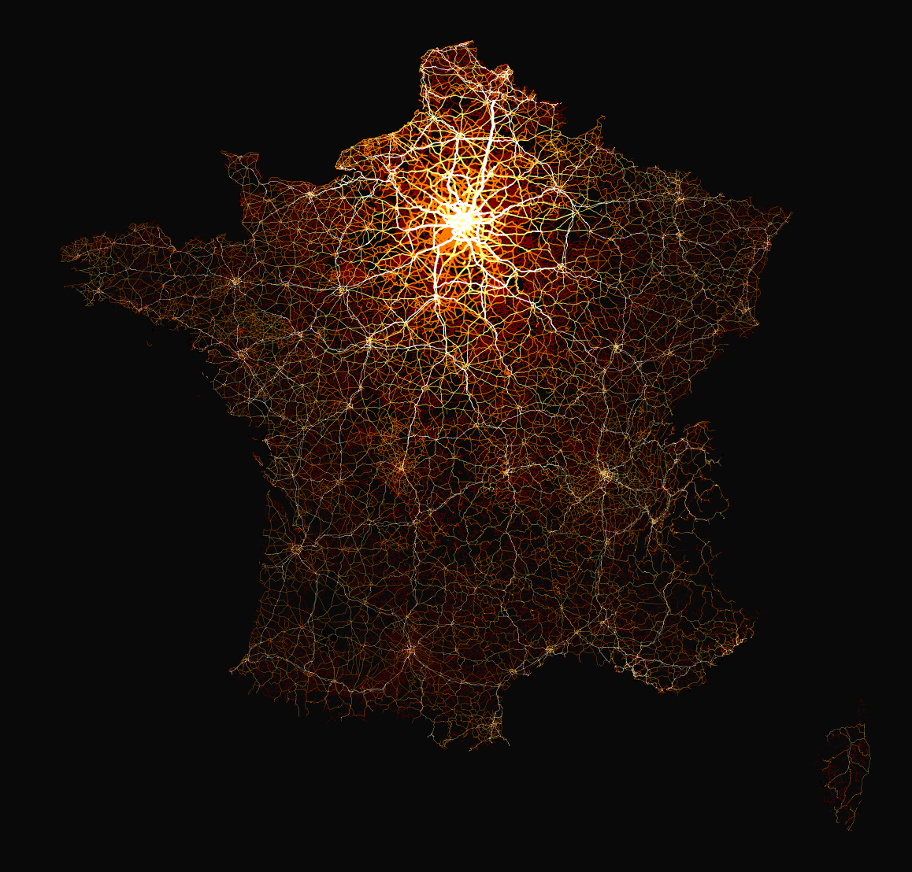
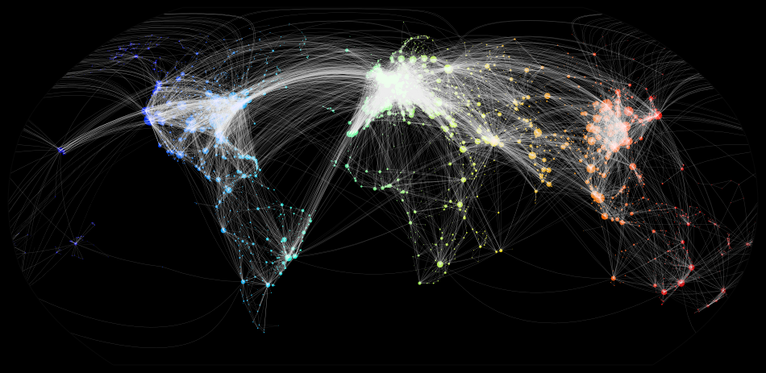

# Python Maps 

A collection of exploratory maps I've created 100% in Python using the book entitled [*Python Maps*](https://locatepress.com/book/pymaps) by Adam Symington, PhD.

Major Python libraries used:
- Pandas and GeoPandas for spatial data manipulation
- Rasterio for working with raster data
- Cartopy to work with map projections
- Shapely to work with individual geometry objects
- matplotlib (PyPlot) for the visuals

